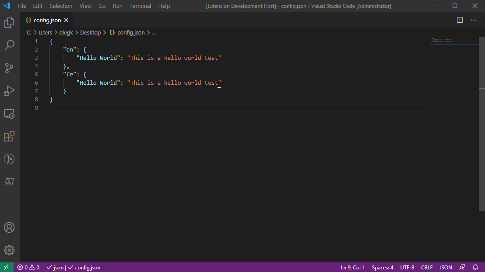
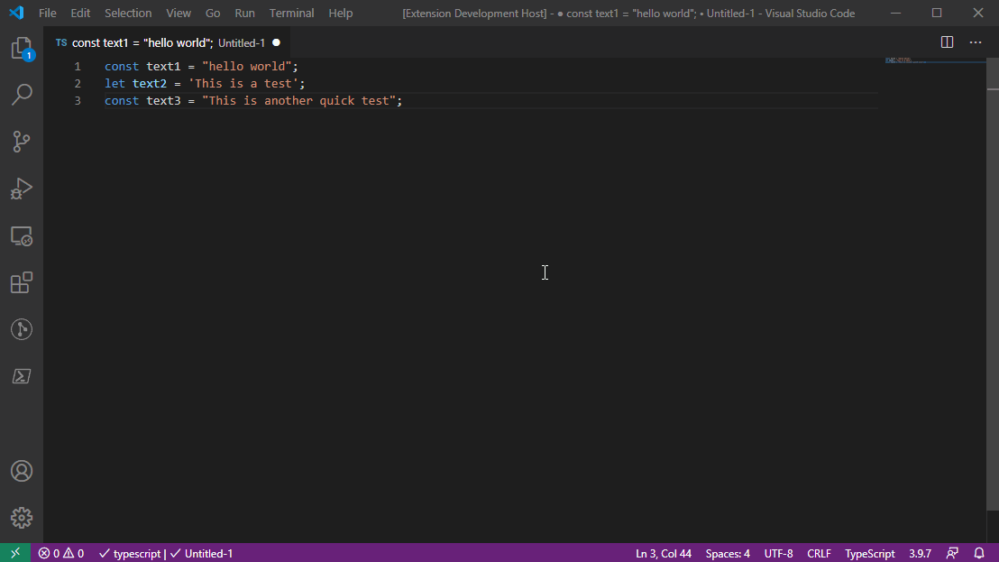

TranslateIO is a VS code extension that helps you translate specific strings or bulk translate. Simply highlight your target text and execute the desired command to translate on the spot.

## Features

* **Translate and Replace command**: Highlight your target text and execute the command to replace the highlighted content with the translated version.

 

* **Translate Strings and Replace command**: Highlight a range of code and execute the command to replace only strings with the translated version.

 

## Extension Settings

This extension contributes the following settings:

* `translateIO.fromLanguage`: Select the language to translate from (default English)
* `translateIO.toLanguage`: Select the language to translate to (default Spanish)

